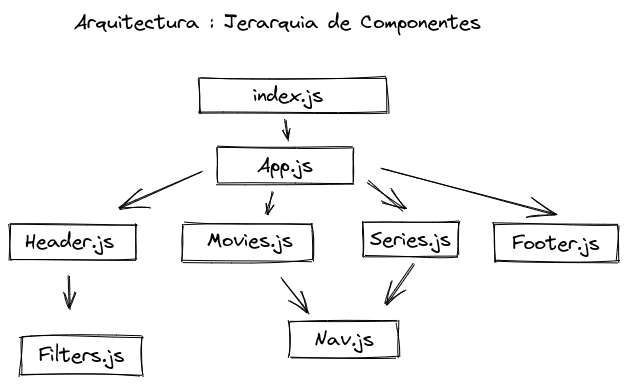

## Retos iniciales para hacer la app

When I made the call to the Api I got a series of errors in the console (cors), I tried to solve it by placing after the fetch.

mode:"no cors"

but then it kept returning an error:

Unexpected token in JSON at position 0

I opted to copy the Api data to a json and place it in the public folder and it stopped giving me problems. I also modified the name of Poster Art => Poster_Art to be able to take its value and paint it.

* The first page is a landing page where user could select whether she wants to see TV shows or movies and some claims and logo of Dreadful Tomato

For this first part create a component called Home and link two sections, one to take the user to watch the movies and the other to watch the series.

* The second one is the list of TV shows. Here, the user could filter TV shows by title and
 release year. In that page the user will see a list of card with the Title, description
 and image from each TV show. 
* The third one is quite similar, but for the movies. The user could filter by title and
 release year as well, to see a list of cards with the information of every movie.

Create two components called Movies (shows movies) and Series (shows series).
As the header adds elements that are not in the home page, create a state variable called isLocation that controls the location of the page where the user is.

Use a reutlizable component called Nav for pagination and the slice method to show only 10 movies or series at a time.

Services => Api.js , Local Storage

## Best Practices
- PropTypes
- default props
- Destructuring
- Manual Testing